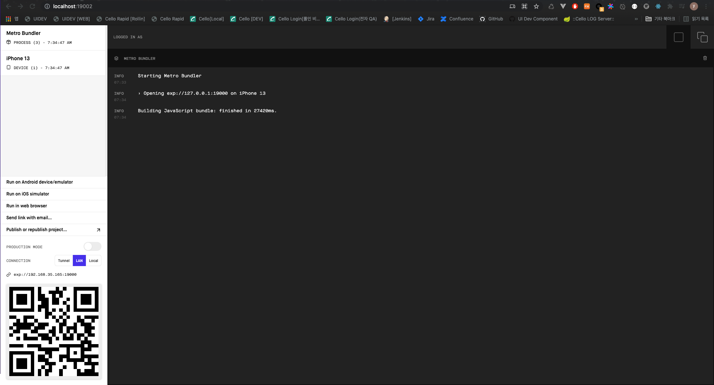
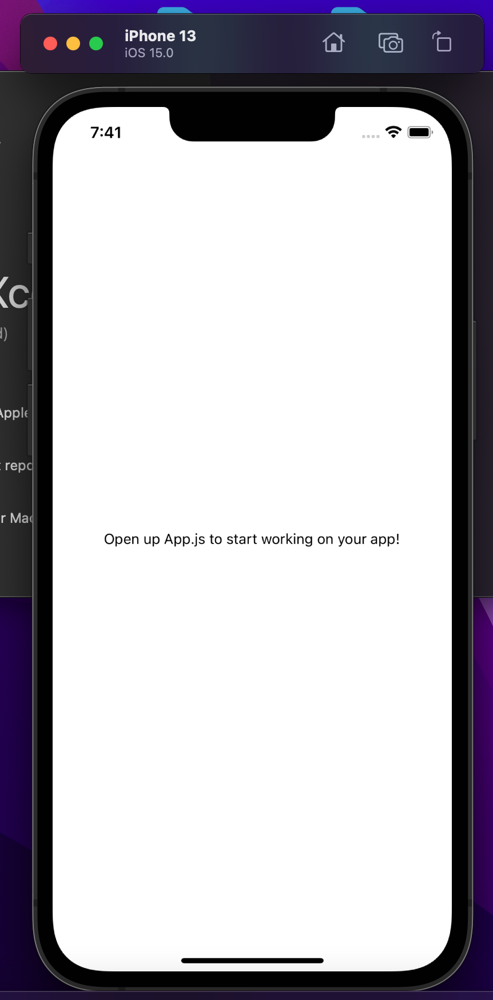
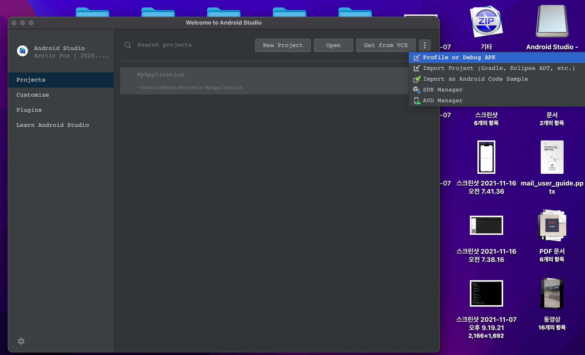
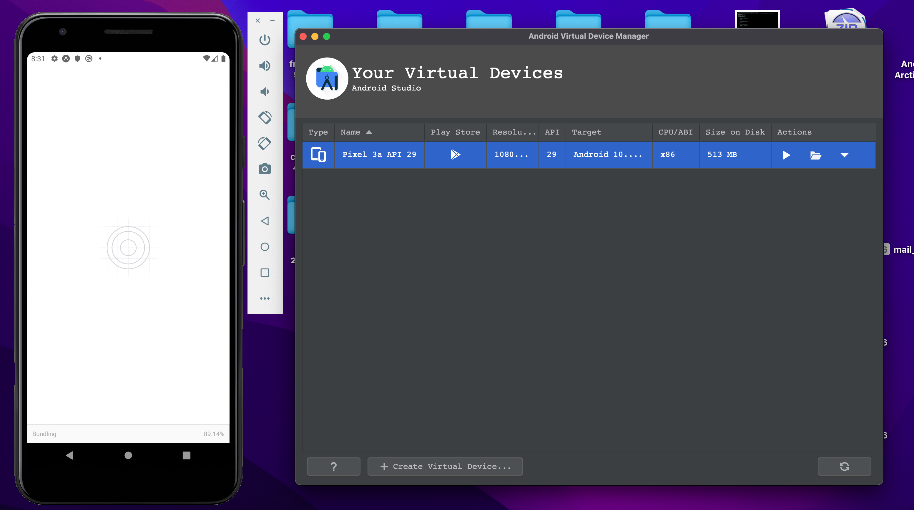
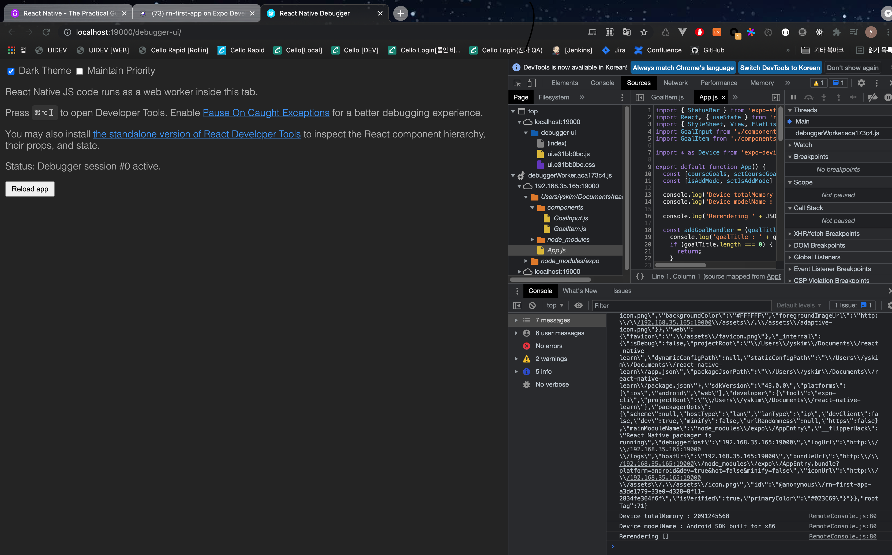
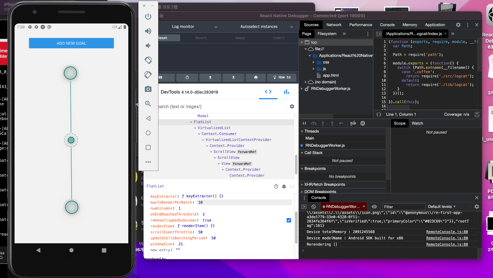

# react native learn

## Expo-Cli 로 초기 설정하기

### Requirement

- Node.js
- OSX ( lastest )
- Xcode ( lastest ) | iOS
- Android Studio | Android

#### Initialize App

```bash
$ sudo npm install -g expo-cli # deprecated와 error가 몇개 보이지만 실행하는데는 지장없다.
$ expo-cli init { app-name }
# 아래 환경 중 택 1
# [v] blank
# [ ] blank (TypeScript)
# [ ] tabs
# [ ] bare
```

#### Build App | Metro Bundler

- QR 코드로 각자 디바이스에서 접근가능 ( Expo App 설치 필수 )
- 백오피스 ( <http://localhost:19002/> ) 에서 " Run on { Environment } "로 디바이스에서 실행 가능

```bash
expo start
```



### IOS Simulator

#### Command Line Tools 버전

```text
xcode -> Preferences > Location > Command Line Tools
* 가장 최선버전 선택
```

#### Simulator 실행

```text
xcode -> Open Developer Tool -> Simulator
```

#### App 실행 ( iOS )

1. 백오피스에서 " Run on iOS simulator " 클릭

<div style="
    width:100%;
    height:300px;
    display: flex;
    align-items: center;
    justify-content: center;">
  
</div>

### Android Simulator

#### SDK Manager

```text
Android Studio > Preference > Apperence & Behavior > System Settings > Android SDKs

- SDK Platforms
[v] Android 10.0 ( lastest )

- SDK Tools
[-] Android SDK Build-Tools 30-rc2
[v] Android Emulator
[v] Android SDK Platform-Tools
[v] Intel x86 Emulator Accelerator (HAXM installer)
```

#### 환경번수 설정

```bash
# /.bash_profile


#------------------------------------------------------------
# Android Simulator
#------------------------------------------------------------
export ANDROID_SDK=/Users/yskim/Library/Android/sdk
export PATH=/Users/yskim/Library/Android/sdk/platform-tools:$PATH
```

#### 즉시 적용

```bash
$ source .bash_profile

# 확인
$ adb
```

#### AVD ( Android Virtual Device ) 실행

- AVD Manager



- Environment ( 타겟 환경에 맞게 세팅 )

```text
[v] Pixel 3a

[v] Q ( API 29, Andorid 10.0 )
```

#### App 실행 ( Android )

1. 백오피스에서 " Run on Android device/emulator " 클릭



## React Native 단점

### 반응형 디자인, 컴포넌트

### No or very little cross-platform styling of components

- 직접 스타일링
- third-party 라이브러리 사용

### Only a basic set of pre-build components

- 직접 컴포넌트 빌드
- third-party 라이브러리 사용

### Tools to create responsive designs but no responsiveness out of the box

- OS와 디바이스 사이즈 보면서, 직접 반응형 디자인 생성

### 빠른 변화

### New versions every month

- 매달 새 버전이 나와 새/변경된 API 확인 필요

### Breaking changes do happen

- 새 버전에서 오류/버그 발생할수 있음

### High Dependency on third-party packages that also change

- third-party 라이브러리에 의존도가 높은데, 해당 라이브러리의 내용이 자주 변경된다.

### Bugs / Workarounds required

- 버그를 우회하기 위한 행위가 필요하다.

## Core Component

### There is no CSS

- Inline Styles
- StyleSheet Object ( Preferred )
- ( Written in Javascript )

> CSS Syntax를 가지고 있지만, 오직 "subset of properties" 와 feature들 만 지원된다.

#### iOS keyboard 활성화

```text
- I/O > Keyboard > Toggle Software Keyboard
- command + K
```

## List Components

### View

- 사용하기 직관적
- 화면이 짤림

```javascript
<View>
  {courseGoals.map((goal, index) => (
    <View style={styles.listItem}>
      <Text key={index}>{goal}</Text>
    </View>
  ))}
</View>
```

### ScrollView

- 사용하기 직관적
- 화면이 짤리지 않음
- 하지만 너무 많은 리스트에서는 성능저하가 발생

```javascript
<ScrollView>
  {courseGoals.map((goal, index) => (
    <View style={styles.listItem}>
      <Text key={index}>{goal}</Text>
    </View>
  ))}
</ScrollView>
```

### FlatList

- 화면이 짤리지 않음
- 하지만 너무 많은 리스트에서도 성능저하를 막을수 있음 ( Recycling List )

```javascript
<FlatList>
  {courseGoals.map((goal, index) => (
    <View style={styles.listItem}>
      <Text key={index}>{goal}</Text>
    </View>
  ))}
</FlatList>
```

## Button

- style을 직접 지정해줄 수 없다. (inline 이든 StyleSheet 이든 간에..)
- 빈 View로 한번 감싸줘야한다.

### Touchable

#### TouchableOpacity

```javascript
<TouchableOpacity activeOpacity={0.8} />
```

#### TouchableHighlight

#### TouchableWithoutFeedback

### Modal

## Debugging

### Console.log

- 가장 기본적인 방법

```javascript
console.log('Rerendering ' + JSON.stringify(courseGoals));
```

#### 현재 Device Info 출력하기

#### expo-device ( expo app )

> https://docs.expo.dev/versions/latest/sdk/device/#devicemodelid

```javascript
import * as Device from 'expo-device';

console.log('Device totalMemory : ' + Device.totalMemory);
console.log('Device modelName : ' + Device.modelName);
```

#### react-native-device-info ( expo app X )

> https://www.npmjs.com/package/react-native-device-info

```javascript
import DeviceInfo from 'react-native-device-info';

console.log('Device ID : ' + DeviceInfo.getUniqueID());
```

### Debug Remote JS

- 브라우저 상에서 디버깅을 할수 있는 기능으로, source를 보면서 breakpoints를 걸 수 있다.



#### AVD | Debug Remote JS

> cmd + m 에서 Debug Remote JS

#### IOS | Debug Remote JS

> cmd + d 에서 Debug Remote JS

### Reload

#### AVD | Reload

> cmd + m 에서 reload

#### IOS | Reload

> cmd + r 또는 cmd + d 에서 reload

### React Native Debugger

#### intall

```bash
brew install --cask react-native-debugger
```

#### download app

> https://github.com/jhen0409/react-native-debugger/releases
> react-native-debugger_0.12.1_universal.dmg

#### port 지정하기

> cmd + t

#### 사용법

1. 사용하고 있는 Chrome Remote Debug JS 있으면 끄기
2. React Native Debugger 켜고 기다리기
3. cmd + t로 Remote Debug JS 의 포트 입력 ( 나의경우는 19000, 크롬 디버거 띄울때의 포트 )



## Syntax

### props.children | 자식 DOM 가져오기

```javascript
const Card = (props) => {
  return (
    <View style={{ ...styles.card, ...props.style }}>{props.children}</View>
  );
};
```

```javascript
<Card style={width: '100%'}>
  <Text>Select a Number</Text>
  <TextInput />
  <View style={styles.buttonContainer}>
    <Button title="YES" onPress={() => {}} />
    <Button title="NO" onPress={() => {}} />
  </View>
</Card>
```

## Style

### Shadow

```javascript
  inputContainer: {
    // flex: 1,
    width: '80%',
    alignItems: 'center',
    shadowColor: '#000',
    shadowOffset: { width: 0, height: 2 },
    shadowRadius: 6,
    shadowOpacity: 0.26,
    elevation: 8, // for android
    backgroundColor: 'white',
    padding: 20,
  },
```

## Tips

### 숫자만 받기

```javascript
const numberInputHandler = (inputText) => {
  setEnteredValue(inputText.replace(/[^0-9]/g, ''));
};
```

### 다른 곳을 클릭하면 키보드 없애기

```javascript
<TouchableWithoutFeedback
  onPress={() => {
    Keyboard.dismiss();
  }}
>
  ...
</TouchableWithoutFeedback>
```

### NaN 체크

```javascript
chosenNumber !== chosenNumber 
```
